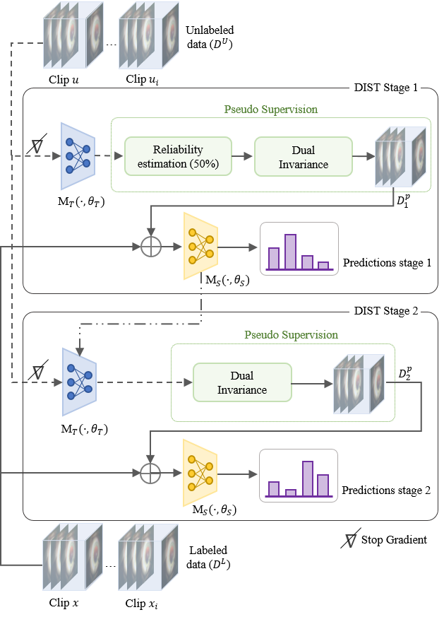
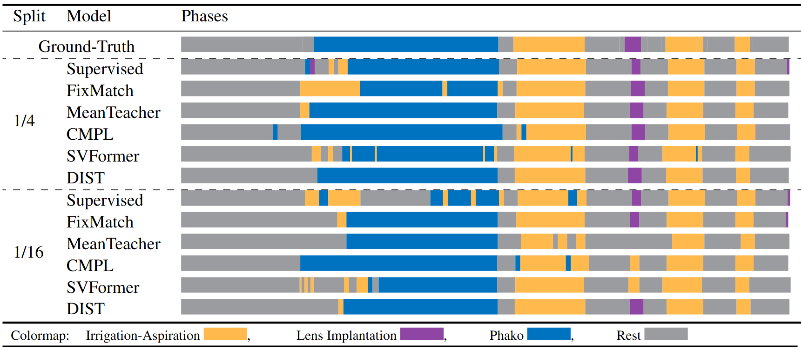
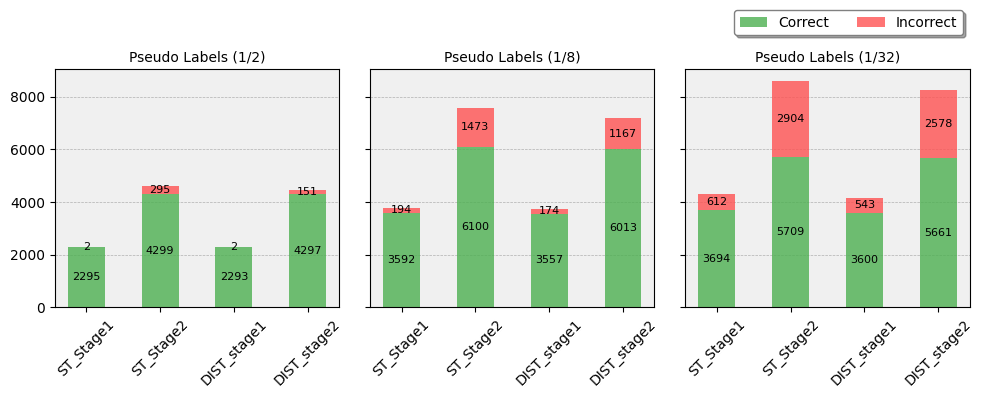

# DIST
Dual Invariance Self-Training for Seliable Semi-Supervised Surgical Phase Recognition

> Semi-supervised learning (SSL) has emerged as a powerful approach to enhance model performance when labeled data is scarce, particularly in fields like video action recognition. By leveraging a small labeled dataset alongside a larger pool of unlabeled data, SSL allows models to extract meaningful patterns, generalize effectively, and mitigate overfitting to the limited labeled samples.
>
> While SSL has demonstrated significant success in action recognition tasks, its application to surgical phase recognition remains underexplored. In this work, we identify the potential of SSL in this domain and propose that more reliable pseudo-supervision can substantially improve performance. To address this, we introduce a novel SSL framework, **Dual Invariance Self-Training (DIST)**, that incorporates pseudo-supervision with **temporal and transformation invariance**, enhancing the model's reliability and robustness.
---
**Overview of the proposed semi-supervised self-training framework**
> Our semi-supervised framework, DIST, operates in two stages: a teacher network generates pseudo-labels for unlabeled data using a reliability estimation method, and our dual invariance strategy filters out unreliable predictions. The retained pseudo-labels and labeled data train a student network, which iteratively refines pseudo-labels and trains in the second stage for improved performance.


---

**Phase prediction performance of various models using the hybrid Transformer network.**
This figure presents a subjective assessment of phase prediction performance for different models across two data splits: 1/4 and 1/16.


---
**Ablation study on the performance of pseudo label selection of DIST vs. ST**
This figure illustrates the correct and incorrect pseudo-labels generated in each stage for both the ablated (ST) and DIST models across three data splits.


---
## Usage
Packages:
```plaintext
matplotlib==3.8.3
moviepy==1.0.3
numpy==1.24.3
opencv-python==4.8.1.78
pandas==2.2.3
pillow==10.0.1
pytorch==2.1.1
scikit-image==0.24.0
scikit-learn==1.3.0
scipy==1.11.4
seaborn==0.13.2
torchmetrics==1.2.1
torchvision==0.16.1
tqdm==4.66.1
wandb==0.16.1
```

## Citation
If you find this project useful, please consider citing:
```
@inproceedings{Nasirihaghighi,
  title={Dual Invariance Self-Training for Seliable Semi-Supervised Surgical Phase Recognition},
  author={},
  booktitle={},
  pages={},
  year={2024},
  organization={}
}
```
## Acknowledgments
